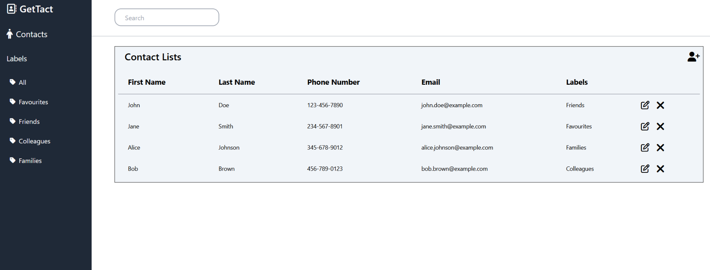

# GetTact App

## Live-Preview
**[Contact Management Website](https://dim-27.github.io/contact-management/)**

)

## Summary
Simple contact management app to manage your contacts

## Design
The design is inspired by:
https://charm.budigunawan.com/

## Features
- User can see all contacts
- User can add new contacts
  - User can add first name, last name, phone, email, and labels
- User can see contact detail
- User can delete contact
- User can search contact using labels or search bar

## Tech Stack
- HTML
- CSS
- Javascript
- DOM
- TailwindCSS
- CRUD operation
- Responsive Web Design
  
## What I've Learned
- How to style website using css Tailwindcss
- How to design multiple version for different devices
- Implementing CRUD operations to store data
- Implementing fetching data from data.json

